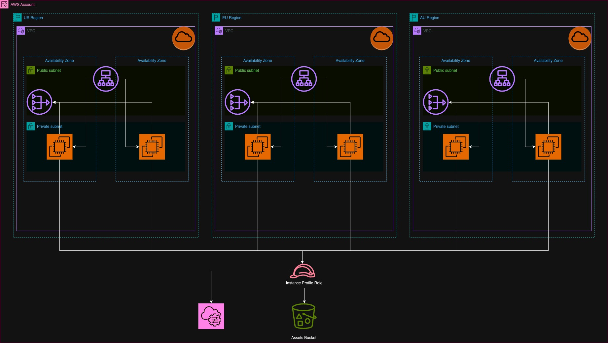

# pd - Simple Web-App

Tis repository deploys the following in your AWS account:
- S3 bucket with your assets deployed in a single region
- IAM instance profile for the Web-App EC2 instances so they can access your assets bucket
- 3-region WebApp infrastructure components

## Table of Contents

- [Design Overview](#design)
- [Deployment](#deployment)

## Design Overview

## Deployment

We use a `Makefile` to install dependencies, lint CloudFormation templates for any issues and also deploy our Web-App to the AWS envronment.

Installing dependencies:
- `make install`

Linting:
- `make lint`

Deploy only Dev environment:
- `make deploy_dev`

Deploy only Prod environment:
- `make deploy_prod`

Deploy both Dev & Prod environments:
- `make deploy_all`
